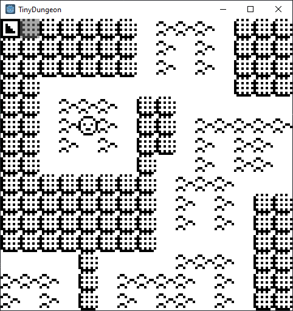

# CA_Roguelike
Maps generated using cellular automata, made in Godot

Attempt to learn Godot by making a really small game. But already getting bigger than I'd planned...

Here's an example of what it looks like:

You can play it here: https://gellelao.itch.io/get-blocked
